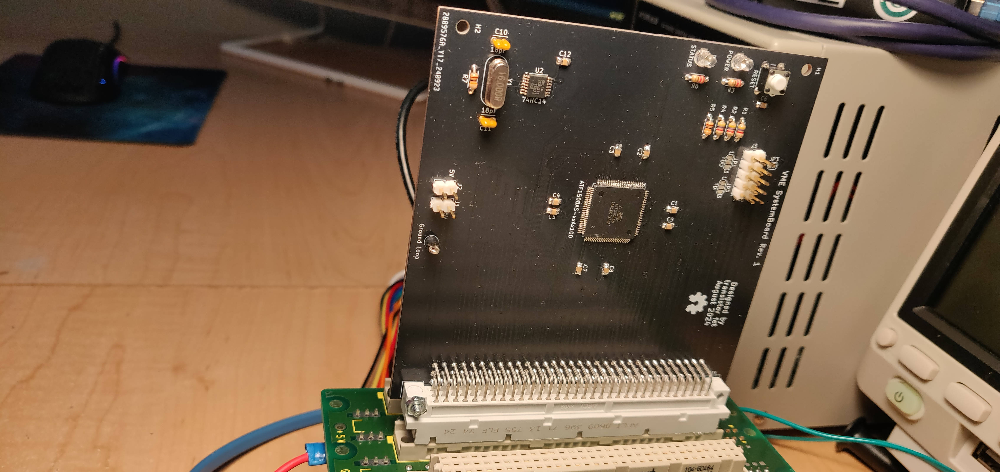

RetroVerse
==========

###### *Started August 06, 2023*

A series of computer cards using the [VME bus](https://en.wikipedia.org/wiki/VMEbus) as a common
backplane, in the style of modular computer equipment, laboratory test equipment, and industrial
controls systems.

I've always liked the VME bus for its adaptability.  It's an asynchronous bus with dynamic sizing,
so it can support both controllers and peripherals that require different signaling speeds and bus
widths to communicate, without requiring a specialized bus interface chip.  It supports multiple
controllers without the need for a special slot on the backplane, because it uses daisy chained
priority bus arbitration.  It uses standard and readily available DIN41612 connectors, comes in a 3U
variant, and it's possible to still buy equipment that conforms to the standard, namely card cases
and power supplies.  The 3U Eurocard standard, which uses 160x100mm boards, is also fairly
affordable for PCB printing, and it's possible to make 100x100mm cards, which can be printed for as
low as $2.  The bus is perhaps slow by modern standards, but for CPUs that are below 100MHz, it's
the perfect bus to build 16-bit and 32-bit retro computers around.

My intention is to build a backplane, dedicated bus arbitration and interrupt controller card, and a
generic 68030-based CPU card to start.  I have ordered an off-the-shelf desktop card case from
[Schroff](https://schroff.nvent.com/en-de/products/enc24576-106) via Digikey, on backorder, and I
plan to adapt an affordable [MeanWell power supply](https://www.meanwell.com/productPdf.aspx?i=488).
I'm hoping to be able to install multiple CPU cards into the same system to make a simple
multiprocessor machine.  I've already made a generic card using a microcontroller wired to the bus,
that I intended to use as a bus analyzer called
[BigBoy](https://github.com/transistorfet/retroverse/tree/main/controllers/bigboy), but I haven't
written software for it yet.

I also intend to eventually make a 68010 version using only DIP chips and hopefully all hardwired
logic, so that a specialized PLD programmer won't be needed to build one.  I might also make cards
with other CPUs.  It should be possible for the system to support different CPUs in the same system
at the same time.  My larger hope is for the VME bus to be used more broadly in the hobbyist
computer community as a common means of interoperability.

Why VMEbus?
-----------

* it uses the eurocard form factor, and equipment such as cases can still be bought new or used

* it's asynchronous, so it can support devices operating at different speeds

* it supports dynamic bus sizing for 8-bit, 16-bit, and multiplexed 32-bit operations in 3U

* in the 6U form factor, it can also support full 32-bit or multiplexed 64-bit operations

* the DIN41612 connectors it uses are still widely available with solder tails

* supports cheap 3U board sizes of 100mm x 160mm or 100mm x 100mm

* also supports 6U board sizes for bigger and more complex devices

Why Not VMEBus?
---------------

* it can be a bit more complicated to interface to for simple 8-bit systems

* it's slower than newer buses like CompactPCI

* if using passive termination instead of active termination, it can draw a lot of current

* each signal can draw a fair amount of current, possible out of range of your drivers

About VMEbus
------------

* [Understanding VMEBus](https://mdavidsaver.github.io/epics-doc/vme/understanding-vme.pdf)
* [VME FAQ from VITA](https://www.vita.com/VMEbus-FAQ)
* [VME P1 Connector Pinout](https://allpinouts.org/pinouts/connectors/buses/vme-versamodule-eurocard-p1/)
* [VME64](https://www.ge.infn.it/~musico/Vme/Vme64.pdf)

Other VME Projects
------------------

#### VMEbus prototyping card PCB:

* [https://github.com/rhaamo/VME](https://github.com/rhaamo/VME)

#### Proto Boards, Blanking Plates, Plate Adapters, ECB backplanes:

* [https://www.ebay.ca/usr/martenelectric](https://www.ebay.ca/usr/martenelectric)
* [https://www.martenelectric.cz/index.html](https://www.martenelectric.cz/index.html)

#### COMET backplane, prototyping card, and single board computer:

* [https://hackaday.io/project/192539-comet68k](https://hackaday.io/project/192539-comet68k)
* [https://github.com/tomstorey/COMET](https://github.com/tomstorey/COMET)
* computer card is missing bus arbitration, but the backplane supports it

Single-CPU System
-----------------

This is generally where I'm at.  I have a simple single-CPU system with SystemBoard, k30p-VME, Tom
Storey's CF Card, and MemBird Woodcock (although it's not used by the software atm).  It can boot
Gloworm, using the CF card as the ATA device, and the FTDIs on k30p as the TTY and network SLIP
connection.  I can ping it from my computer over SLIP, and run applications off the CF card.

Desktop Case
------------

I bought a brand new Schroff PropacPro 3U 63HP 266mm deep Unshielded Complete Desktop case.  I
initially requested a quote from Schroff, but unsurprisingly they sent me back a list of authorized
redistributors instead.  It turned out that Digikey did actually have the cases available for
backorder but the listing was uncategorized, so you had to search specifically for the part number
to find it.

* [https://schroff.nvent.com/en-ca/products/enc24576-006](https://schroff.nvent.com/en-ca/products/enc24576-006)
* [https://www.digikey.ca/en/products/detail/schroff/24576006/24659562?s=N4IgTCBcDaIARgCwFYDsA2AtABm%2BkAugL5A](https://www.digikey.ca/en/products/detail/schroff/24576006/24659562?s=N4IgTCBcDaIARgCwFYDsA2AtABm%2BkAugL5A)

Backplane
---------

I bought a Schroff 23000-041 11-Slot backplane, used from eBay.  Luckily it has automatic
daisy-chaining, so when a slot doesn't have a card in it, the daisy-chained signals are shorted in
order to bypass that slot.  It also has active termination, which I have enabled with the jumpers,
so it takes only 10mA or so of 5V power without any cards connected.

k30p-VME
--------

A CPU card with a Motorola 68030 CPU, and an ATF1508AS CPLD for the control logic.  It has 2MB of
static RAM onboard, 512KB of Flash, a MC68681 dual serial port controller, with space for two
onboard FTDIs, and some push-button and LEDs that can be controlled by the serial controller.  The
CPLD can control the onboard transceivers to make a VME request from the CPU, based on the address
that the CPU is requesting.  I've tested it with 8-bit and 16-bit cycles, but I've designed it with
the transceivers to make an A40/MD32 bus access.

In building it, I found a number of issues with the first revision.  The transceivers don't turn off
when the CPLD is being programmed, or is unprogrammed, and that means they write into each other,
and can damage themselves.  I reworked some pull-up resistors to disable the transceivers the OE
signals are tri-stated.  I also had the FTDI powered by the board, which meant it disconnected from
the computer every time the board was power cycled, which was quite a problem when testing.  I tried
to rework it to power from the USB bus, but that didn't work, so I removed it and am using an
external FTDI, which is powered by the bus and doesn't seem to have a problem talking to the serial
port controller that's using a different power source.  The full errata is here:
[k30p-VME-rev1-errata](https://github.com/transistorfet/retroverse/blob/main/controllers/computie-vme/hardware/k30p-VME/revisions/k30p-VME-rev1-errata.txt)

 with grey plastic collars to hold the screws in place.")

MemBird Woodcock
----------------

A memory card with up to 4MB of either Static RAM or Pseudo-static RAM powered by either 5V or 3.3V,
which can be selected by a soldered jumper and by using different chips (memory and transceiver
chips in particular).  It can only respond to A24 cycles, and only 8-bit or 16-bit accesses, but
that should serve well enough as common memory for when I have multiple CPU cards.  In future I will
make another MemBird board with an FPGA and SDRAM to allow for 128MB+ of memory, but until then,
this will suffice.

The building of this board went really smoothly.  Soldering went better than normal for SMT parts.
I was using ChipQuik NoClean Liquid flux, which might have helped.  I only had one chip that was
visibly unconnected on closer inspection, and in testing the board, I haven't found any unexpected
bridges.  I didn't even have to use my hot air rework station.  The board was behaving strangely
when I first tested it before I cleaned the flux off, but once I cleaned it and let it dry
overnight, it worked perfectly.

SystemboardSMT
--------------

A system board with an ATF1508AS in the centre, and a clock, and that's about it.  It's primary
function is to handle the bus arbitration logic, but I can also use it as a dummy 8-bit peripheral
for testing.

I designed and built this board before the k30p and MemBird Woodcock, because it was simple and
would act as a test for the ATF1508, which I hadn't used before, besides in the devkit that I bought
from Atmel.  The logic turned out to be very wrong, and that caused problems for the k30p, which was
hanging indefinitely.  I thought it was the k30p's logic, but it turned out it wasn't receiving the
bus grant from this card.

BigBoy
------

This was the first card I made and I intended to use it as a bus analyzer among other things, but
it's a bit too slow to catch most cycles, so I think I'll need an FPGA card instead for that
function, but it can work as a slow peripheral.  It has an STM32H743 microcontroller in a 208 pin
QFP package in the centre with the 5V tolerant I/O connected directly to the VME bus for the control
signals, and through transceivers for the data and address signals.  On the board is also a 100BaseT
ethernet interface, a full speed USB port (so 12Mbps I assume is the fastest), a microSD card slot
(where I accidentally put the footprint on backwards), and a few headers for external FTDIs, I2C,
and SPI device.

. It has a large grep DIN41612 connector on the right side, and a metal-shielded RJ-45 jack and some buttons and LEDs on the left.")

