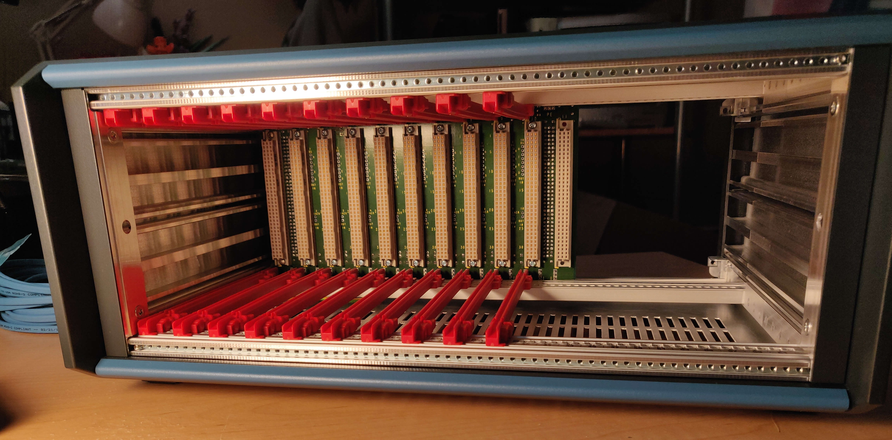
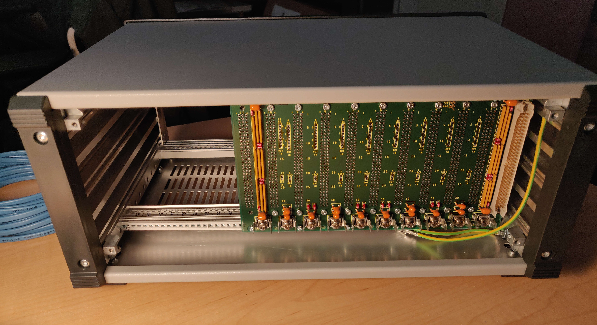
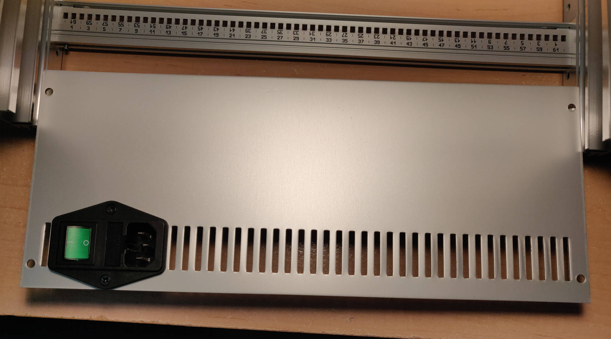
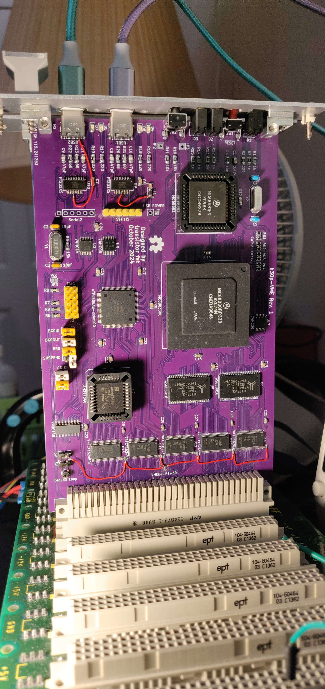
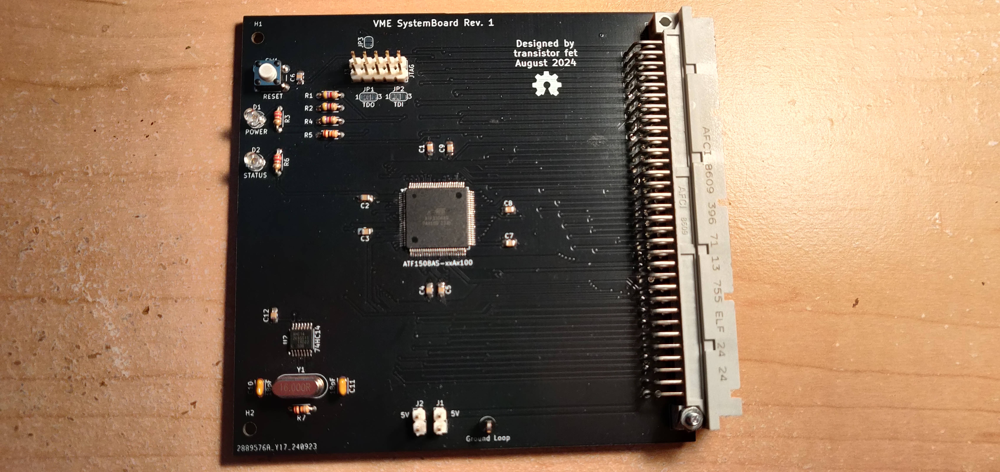

RetroVerse
==========

###### *Started August 06, 2023*

A collection of computer cards using the [VME bus](https://en.wikipedia.org/wiki/VMEbus) as a common
backplane, in the style of modular computer equipment, laboratory test equipment, and industrial
controls systems.  The project name is a combination of Retro-computers (newly designed and built
computers that are based on old CPUs and parts), and Versa (the V in VME, which stands for Versa
Module Eurocard).

I've always liked the VME bus for its adaptability.  It's an asynchronous bus with dynamic sizing,
so it can support both controllers and peripherals that require different signaling speeds and bus
widths to communicate, without requiring a specialized bus interface chip.  It supports multiple
controllers without the need for a special slot on the backplane, because it uses daisy chained
priority bus arbitration.  It's based on the Eurocard standard form factor, and uses standard and
readily available DIN41612 connectors, comes in a 3U variant, and it's possible to still buy
equipment that conforms to the standard, namely card cases and power supplies.  The 3U Eurocard
standard, which uses 160x100mm boards, is also fairly affordable for PCB printing, and it's possible
to make not-quite-standard 100x100mm cards, which can be printed for as low as $2.  The bus is
perhaps slow by modern standards, but for CPUs that are below 100MHz, it's the perfect bus to build
16-bit and 32-bit retro computers around.

So far, I have bought an off-the-shelf desktop card case from
[Schroff](https://schroff.nvent.com/en-de/products/enc24576-106) via Digikey (backordered), a used
Schroff 3U 11-slot backplane from eBay, and an affordable [MeanWell power
supply](https://www.meanwell.com/productPdf.aspx?i=488) to power it.  I've designed and built a CPU
card with a Motorola MC68030, onboard static RAM and Flash memory, and two serial ports, a small
16-bit memory card with up to 4MB of static RAM, and a board for handling the bus arbitration and
interrupt signals on the bus (separate from the CPU card since I intend to use multiple CPU cards in
the same system).  I've also built Tom Storey's CompactFlash card from
[COMET](https://github.com/tomstorey/COMET) to use as the main secondary storage for the system.
Before building these, I had also designed and built a generic card using an STM32 microcontroller
wired to the bus signals called
[BigBoy](https://github.com/transistorfet/retroverse/tree/main/components/bigboy), which I had hoped
to use as a bus analyzer, but it's a bit too slow for that, so I'll probably program it as a generic
peripheral instead.

I had originally intended to design and build my own backplane using 4-row connectors with some of
the P2 connector's signals on an extended P1, but I abandoned that idea in the interest of
interoperability with existing used VME equipment and ended up buying a used 11-slot Schroff
backplane from eBay.  Tom Storey has designed a 3-slot and 8-slot backplane as part of
[COMET](https://github.com/tomstorey/COMET) which is a good choice for those who wish to build their
own.

I also intend to eventually make an MC68010 version using only DIP chips and hopefully all hardwired
logic, so that there's no need for specialized PLD programmers.  I might also make cards with other
CPUs.  It should be possible for the system to support different CPUs in the same system at the same
time, running their own code.  My larger hope is for the VME bus to be used more broadly in the
hobbyist retro computer community as a common means of constructing systems.

Some of the design and build process was live-streamed and recordings are available at
[youtube.com/@transistorfet](https://www.youtube.com/@transistorfet)

Why VMEbus?
-----------

* it uses the eurocard form factor, and equipment such as cases can still be bought new or used

* it's asynchronous, so it can support devices operating at different speeds

* it supports dynamic bus sizing for 8-bit, 16-bit, and multiplexed 32-bit operations in 3U

* in the 6U form factor, it can also support full 32-bit or multiplexed 64-bit operations

* the DIN41612 connectors it uses are still widely available with solder tails

* supports cheap 3U board sizes of 100mm x 160mm or 100mm x 100mm

* also supports 6U board sizes for bigger and more complex devices

Why Not VMEBus?
---------------

* it can be a bit more complicated to interface to for simple 8-bit systems

* it's slower than newer buses like CompactPCI

* when using passive termination instead of active termination, it can draw a lot of current (2A+)
  with no cards

* each signal can draw a fair amount of current, which may be out of range for some logic chips (the
  standard requires that each pin can sink 48mA or more but typically it's <25mA in smaller and
  slower systems)

About VMEbus
------------

* [Understanding VMEBus](https://mdavidsaver.github.io/epics-doc/vme/understanding-vme.pdf)
* [VME FAQ from VITA](https://www.vita.com/VMEbus-FAQ)
* [VME P1 Connector Pinout](https://allpinouts.org/pinouts/connectors/buses/vme-versamodule-eurocard-p1/)
* [VME64](https://www.ge.infn.it/~musico/Vme/Vme64.pdf)

Other VME Projects
------------------

#### VMEbus prototyping card PCB:

* [https://github.com/rhaamo/VME](https://github.com/rhaamo/VME)

#### Proto Boards, Blanking Plates, Plate Adapters, ECB backplanes:

* [https://www.ebay.ca/usr/martenelectric](https://www.ebay.ca/usr/martenelectric)
* [https://www.martenelectric.cz/index.html](https://www.martenelectric.cz/index.html)

#### COMET backplane, prototyping card, and single board computer:

* [https://hackaday.io/project/192539-comet68k](https://hackaday.io/project/192539-comet68k)
* [https://github.com/tomstorey/COMET](https://github.com/tomstorey/COMET)
* computer card is missing bus arbitration, but the backplane supports it

[If you know of any other hobbyist VME components or projects that others can build, please get in
contact with me.  I'd love to add them to this list]

Single-CPU System
-----------------

This is generally where I'm at, as of March 2025.  I have a simple single-CPU system with
SystemBoard, k30p-VME, Tom Storey's CF Card, and MemBird Woodcock (although it's not used by the
software atm).  It can boot [Gloworm](https://github.com/transistorfet/gloworm), using the CF card
as the ATA device, and the FTDIs on k30p as the TTY and a SLIP connection for networking.  I can
ping it from my computer over SLIP, and run applications off the CF card.

![alt text](images/complete-single-cpu-system-front.jpg "A schroff 3U 63HP PropacPro case, looking face on and a bit downward at the front, which is trimmed in a very dark grey aluminum piece with two straight dull blue rounded aluminum top and bottom trim above and below where the cards are inserted.  The top of the case, which is barely showing, is light grey.  It has space for 15 slots spaced out horizontally, where cards can be inserted, oriented vertically, along bright red plastic guide rails.  Only 7 of the 10 guide rails are showing, with the others blocked by the front panels of 3 of the cards, with a gap of 3 slots between the second and third one.  The right 5 slots don't have guide rails.  The left-most slot has a blank aluminum plate with a few holes in it that allow a bright deep green LED inside to shine through.  Next to it is a white aluminum panel with black text that shows a partially obscured ComputieVME with a Motorola logo and k30p-VME below that.  It has 4 rows of pairs of LEDs and buttons, two USB-C ports with a mauve and a teal green cable plugged into each, and a white trapezoid handle below.  There's an empty slot and then Tom Storey's CF card is next to that with a CompactFlash card inserted in the front and no front panel.  Membird is next to it but not visible except for the dull green power LED.  BigBoy with a similar custom white aluminum front panel is next to it, with BigBoy in black text, 2 x 2 blue LEDs, a microSD slot, microB USB and RJ-11 jack labelled Ethernet on the front panel.  The right half of the 11-slot VME backplane is just visible, mounted in the left part of the case, with a space visible in the back where the remaining 4-slots-worth of space shows the back of the case, and the rear of the black power entry module.  Mounted in the right-most side of the case is a Meanwell powersupply taking up 8HP (2 slots), and the full 3U of height, wrapped in a thin metal shell with a diagonal pattern of round holes that expose most of the inside.  An 8HP blank plate with 4 knurled thumb-screws in the 4 corners and a trapezoid handle at the bottom and a protective film with 2 vertical blue lines still covering it, is mounted in the right most spot to block the power supply.")

Desktop Case
------------

I bought a brand new Schroff PropacPro 3U 63HP 266mm deep Unshielded Complete Desktop case.  I
initially requested a quote from Schroff, but unsurprisingly they sent me back a list of authorized
redistributors instead.  It turned out that Digikey did actually have the cases available for
backorder but the listing was uncategorized, so you had to search specifically for the part number
to find it.

* [https://schroff.nvent.com/en-ca/products/enc24576-006](https://schroff.nvent.com/en-ca/products/enc24576-006)
* [https://www.digikey.ca/en/products/detail/schroff/24576006/24659562](https://www.digikey.ca/en/products/detail/schroff/24576006/24659562)

I also bought a [Schurter Power Entry
Module](https://www.digikey.ca/en/products/detail/schurter-inc/4304-6091/2645678) and cut a hole in
the back aluminum panel to install it.  It's wired to the Meanwell RT-85B power supply, and power
from that is wired to the backplane.  I'd like to eventually add a current meter on the front,
mounted in an 8HP blanking plate I've bought, but I'm still waiting for parts to arrive.

Backplane
---------

I bought a Schroff 23000-041 11-Slot backplane, used from eBay.  Luckily it has automatic
daisy-chaining, so when a slot doesn't have a card in it, the daisy-chained signals are shorted in
order to bypass that slot.  It also has active termination, which I have enabled with the jumpers,
so it takes only 10mA of 5V power without any cards connected.

k30p-VME
--------

A CPU card with a Motorola 68030 CPU, and an ATF1508AS CPLD for the control logic.  It has 2MB of
static RAM onboard, 512KB of Flash, a MC68681 dual serial port controller, with space for two
onboard FTDIs, and some push-button and LEDs that can be controlled by the serial controller.  The
CPLD can control the onboard transceivers to make a VME request from the CPU, based on the address
that the CPU is requesting.  I've tested it with 8-bit and 16-bit cycles, but I've designed it with
the transceivers that are required to make an A40/MD32 bus access, and hope to implement it soon
using BigBoy as the test peripheral.

While building the first revision, I found a number of issues.  The transceivers don't turn off when
the CPLD is being programmed, or when it's unprogrammed, and that means they write into each other,
and can damage each other.  I reworked in some pull-up resistors for the /OE signals to disable the
transceivers when the CPLD outputs are low or tri-stated.  I also originally had the FTDI powered by
the board, which meant it would disconnect from the computer every time the board was power cycled,
which was quite problematic when testing.  I tried to rework it so that it was powered by the USB
bus, but at first that didn't work.  After replacing the chip with an external FTDI, I tried
reworking it again and found that the USB-C cable only works in one orientation because I don't have
the main differential pair from each side of the USB-C connector jumped together.  The full errata
is here:
[k30p-VME-rev1-errata](https://github.com/transistorfet/retroverse/blob/main/components/computie-vme/hardware/k30p-VME/revisions/k30p-VME-rev1-errata.txt)

")

, a fuse holder, and a plug for an IEC power cable.  It's laying flat on the desk and just in view is the rear section of the inside frame of the case with the top and bottom panels removed showing the shiny aluminum rails with black silkscreen text showing the number markings from 1 to 63 HP, two rows which count in opposite directions and can be read in the orientation of ascending numbers (ie. the bottom row is right way up and the top row is upside down but could be read the right way from 1-63 if if the rail was turned around)")

MemBird Woodcock
----------------

A memory card with up to 4MB of either Static RAM or Pseudo-static RAM powered by either 5V or 3.3V,
which can be selected by a soldered jumper and by using different chips (memory and transceiver
chips in particular).  It can only respond to A24 cycles, and only 8-bit or 16-bit accesses, but
that should serve well enough as common memory for when I have multiple CPU cards.  In future I will
make another MemBird board with an FPGA and SDRAM to allow for 128MB+ of memory, but until then,
this will suffice.

The building of this board went really smoothly.  Soldering went better than normal for SMT parts.
I was using ChipQuik NoClean Liquid flux, which worked well.  I only had one chip that was visibly
unconnected on closer inspection, and I didn't find any unintended bridges.  The board was behaving
strangely when I first tested it before I cleaned the flux off, but once I cleaned it and let it dry
overnight, it worked perfectly.

It's named after the American Woodcock, a small bird that moves along with a slow rhythmic walk,
since this card only has a small amount of memory, and will be slower to access, being only 16-bits.

SystemboardSMT
--------------

A system board with an ATF1508AS in the centre, and a clock, and that's about it.  It's primary
function is to handle the bus arbitration logic, but I can also use it as a dummy 8-bit peripheral
for testing.

I designed and built this board second, before the k30p and MemBird Woodcock, because it was simple
and would act as a test for the ATF1508, which I hadn't used before (other than in the devkit I
bought from Atmel).  The initial logic for the bus arbitration state machine turned out to be very
wrong, and that was causing problems for the k30p, which was hanging indefinitely.  I thought it was
the k30p's logic, but it turned out it wasn't receiving the bus grant from this card.

BigBoy
------

This was the first card I made and I intended to use it as a bus analyzer among other things, but
it's a bit too slow to catch most cycles, so I think I'll need an FPGA card instead for that
function, but it can work as a slow peripheral.  It has an STM32H743 microcontroller in a 208 pin
QFP package in the centre with the 5V tolerant I/O connected directly to the VME bus for the control
signals, and through transceivers for the data and address signals.  On the board is also a 100BaseT
ethernet interface, a full speed USB port (so 12Mbps I assume is the fastest), a microSD card slot
(where I accidentally put the footprint on backwards), and a few headers for external FTDIs, I2C,
and SPI device.

It's called BigBoy because it has the big boy microcontroller in the largest TQPF package available,
with a big 4-row DIN41612 connector which was an idea to add an extra row to P1 for the upper data
and address signals of a 32-bit system, which is optional (the 4-row connector can be plugged into a
3-row or 4-row backplane).  I've mostly abandoned this idea in favour of sticking to the standard,
and using the A40/MD32 cycle on a 3U system, or perhaps eventually making a 6U system and cards if I
want full-sized, higher speed, 32- or 64-bit systems in the future, all while maintaining
interoperability with existing used backplanes.  The logo is of [Bronson the
Cat](https://www.instagram.com/iambronsoncat/?hl=en) who is *such a big boy*

. It has a large grep DIN41612 connector on the right side, and a metal-shielded RJ-45 jack and some buttons and LEDs on the left.")

