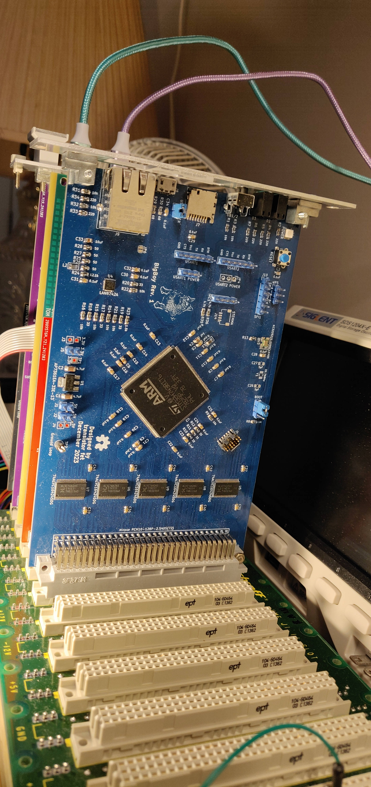

BigBoy
======

Status: Built & Tested but with design issues (see errata)

Latest: Rev. 1

### About

A generic card with an STM32H7 microcontroller on it that interfaces to the VME bus using GPIO.
I had intended to use it as a bus analyzer, but it's a bit too slow for the k30p CPU at 12.5MHz.

[Revision 1 Notes & Errata](revisions/BigBoy-rev1-errata.txt)

[Revision 2 Schematic](revisions/BigBoy-rev1.pdf)

[Revision 1 Gerbers](revisions/BigBoy-rev1.zip)

