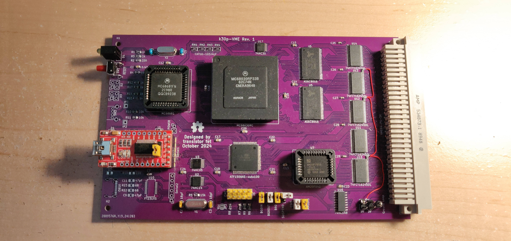

k30p-VME
========

Status: Built & Tested but with problems

Latest: Rev. 1

### About

A CPU card for a VME-based computer system using an MC68030 with some onboard RAM and Flash, and a
onboard serial ports with integrated FTDI Serial-to-USB controllers, and a programmable ATF1508
CPLD for glue logic.  The 'p' in the name stands for Programmable due to the CPLD.

I've built and tested Rev. 1 but had to do some rework to get it running, and there are some
uncorrectable issues with the design that will require a new revision.  The full list of issues is
available in the errata linked below.  I intend to make a Rev. 2 in the next few months

[Revision 2 Notes & Errata](revisions/k30p-VME-rev1-errata.txt)

[Revision 2 Schematic](revisions/k30p-VME-rev1.pdf)

[Revision 2 Gerbers](revisions/k30p-VME-rev1.zip)

Sourcing Parts
--------------

- MC68681
    - eBay, AliExpress, or other resellers are the only sources for these chips
- MC68030RC or MC68030RP:
    - eBay, AliExpress, or other resellers are the only sources for these chips

- 128-pin 13x13 PGA Socket
    - Phoenix Enterprise Connectors: https://www.peconnectors.com/sockets-pga-cpu-and-memory/hws4514/
    - Digikey: https://www.digikey.ca/en/products/detail/mill-max-manufacturing-corp/510-43-128-13-041001/7753825
    - Mouser: https://www.mouser.ca/ProductDetail/Aries-Electronics/128-PGM13039-10
    - (Not sure if correct pin arrangement) https://www.mouser.ca/ProductDetail/Preci-dip/510-87-128-13-041101

- everything else is currently in production (as of 2025) and should be available at Digikey or Mouser

