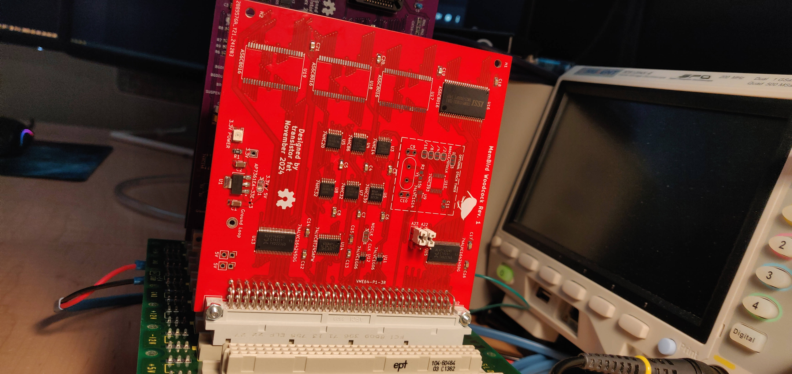

MemBird - Woodcock
==================

Status: Build & Tested

Latest: Rev. 1

### About

A 16-bit VME memory card with 4MB of Static RAM at either 5V or 3.3V

It's named after the American Woodcock, a small, slow-walking bird, since this card
only has a small amount of memory, and will be slower to access, being only 16-bits.

They are very cute birds, with an adorable walk, and a funny call
https://www.youtube.com/watch?v=fpCO6CUH8Zc
https://www.youtube.com/watch?v=97nnyyvXzmA

[Revision 1 Notes & Errata](revisions/MemBird%20-%20Woodcock-rev1-errata.txt)

[Revision 1 Schematic](revisions/MemBird%20-%20Woodcock-rev1.pdf)

[Revision 1 Gerbers](revisions/MemBird%20-%20Woodcock-rev1.zip)

