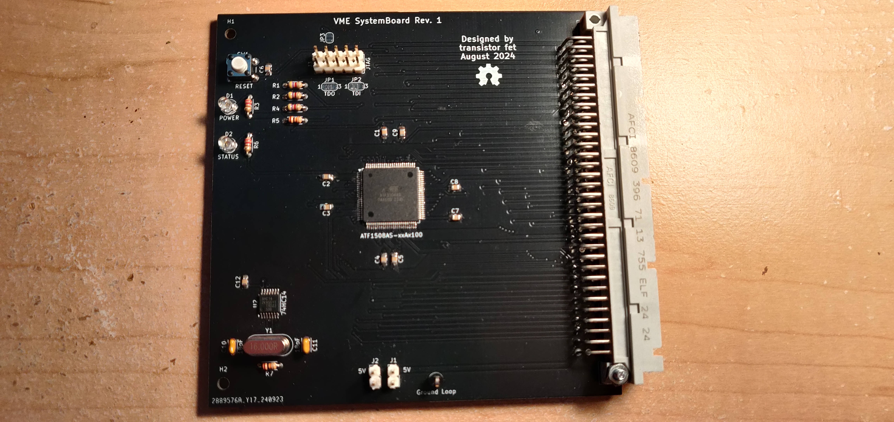

SystemBoard
===========

Status: Built & Tested, with minor issues (see errata)

Latest: Rev. 1

### About

A somewhat generic card with an ATF1508 programmable logic device, which is intended to act as the
system board of the VME bus, handling the resolution and granting of the bus during bus
arbitration, and interrupt acknowledging.  It has a clock and a reset button, which can be
programmed in the logic to reset all devices on the bus.

[Revision 1 Notes & Errata](revisions/SystemBoardSMT-rev1-errata.txt)

[Revision 1 Schematic](revisions/SystemBoardSMT-rev1.pdf)

[Revision 1 Gerbers](revisions/SystemBoardSMT-rev1.zip)

